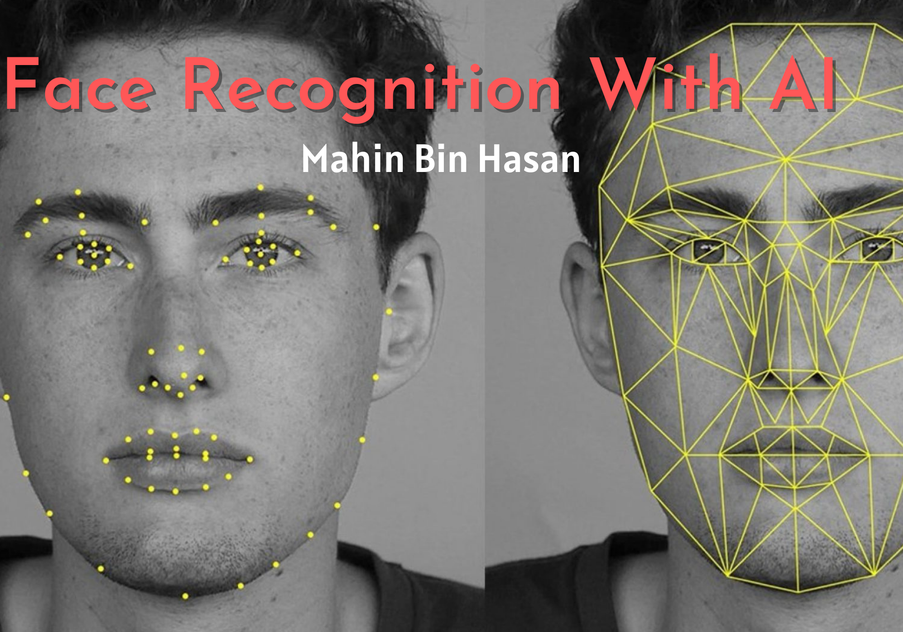
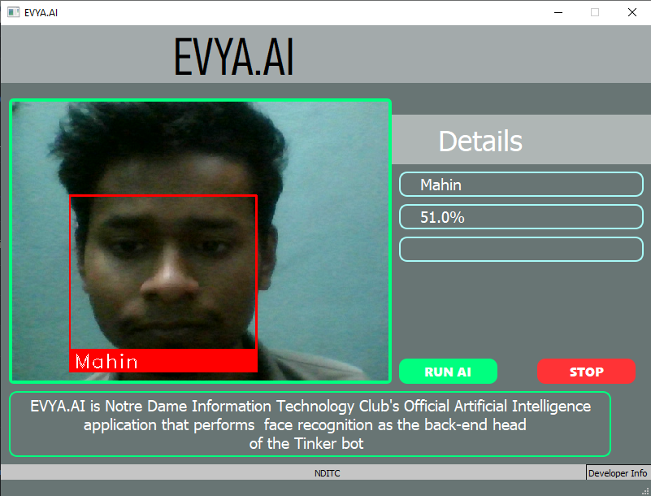
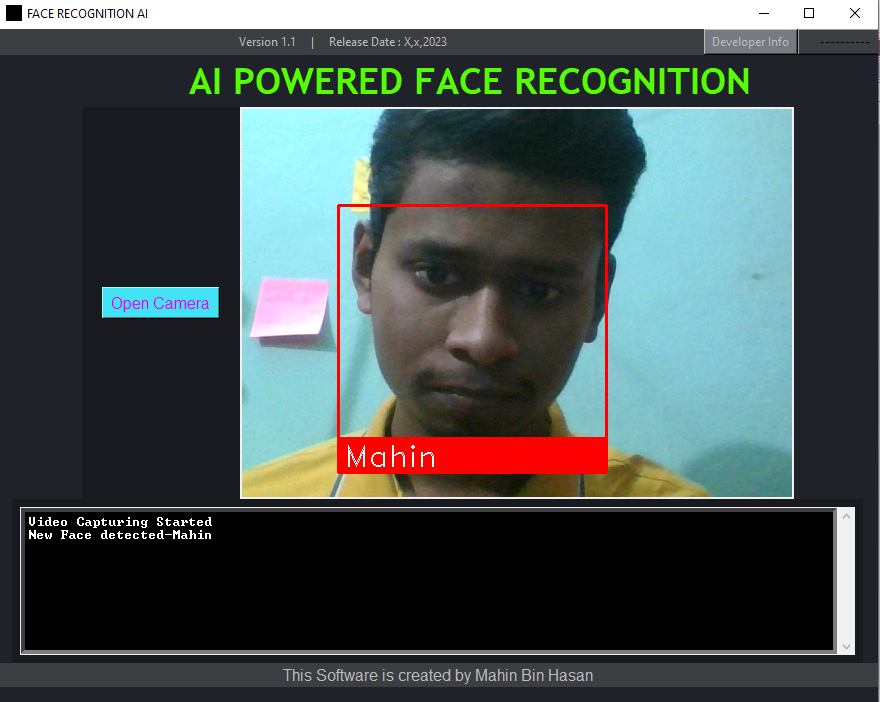

# Face-recognition-AI
Python based face recognition project with GUI

 

## Tech Stack
 - Python==3.9
 - click==8.1.3
 - colorama==0.4.6
 - comtypes==1.1.14
 - dlib==19.22.99
 - face-recognition==1.3.0
 - face-recognition-models==0.3.0
 - numpy==1.24.1
 - opencv-python==4.7.0.68
 - Pillow==9.4.0
 - pypiwin32==223
 - pyttsx3==2.90
 - pywin32==305

 

## How to use?
- Install [Python](https://www.python.org/downloads/) 3.9+ version on your device
- Download the project zip file
- Setup the **virtual evnvironment** using [requirements.txt](requirements.txt) file
- Enjoy the application experience

 

## How to contribute?
- Start a new [issue](https://github.com/mahinbinhasan/Face-recognition-AI/issues/new)
- Solve an existing [issue](https://github.com/mahinbinhasan/Face-recognition-AI/issues)

 

## Credits
[Mahin Bin Hasan](https://www.facebook.com/root.mahin)

 

## Snaps in Action

 

## License
Details can be found in [LICENSE](LICENSE)

 

## Contact Info
- [Telephone](tel:01580-906164)
- [Email](mailto:allmahin149@gmail.com)
- [Website](http://mahin.ml/)
- [Facebook](https://www.facebook.com/root.mahin)
- [LinkedIn](https://www.linkedin.com/in/mahinbinhasan/)
